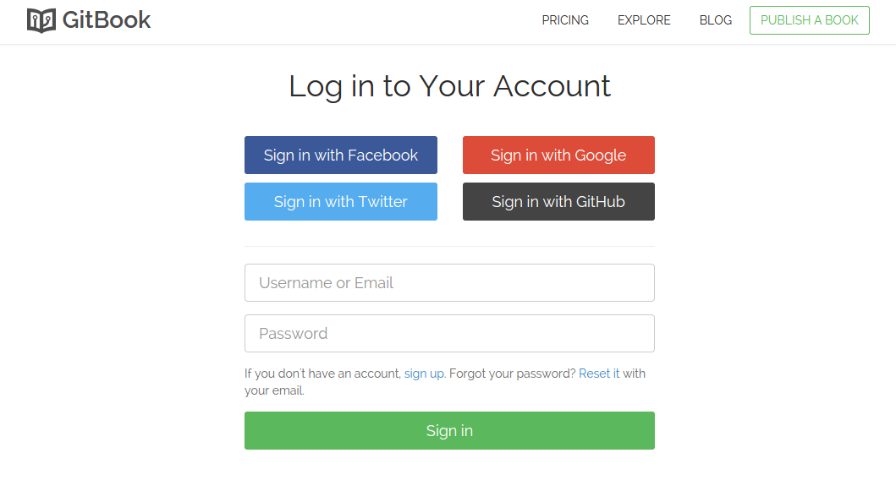
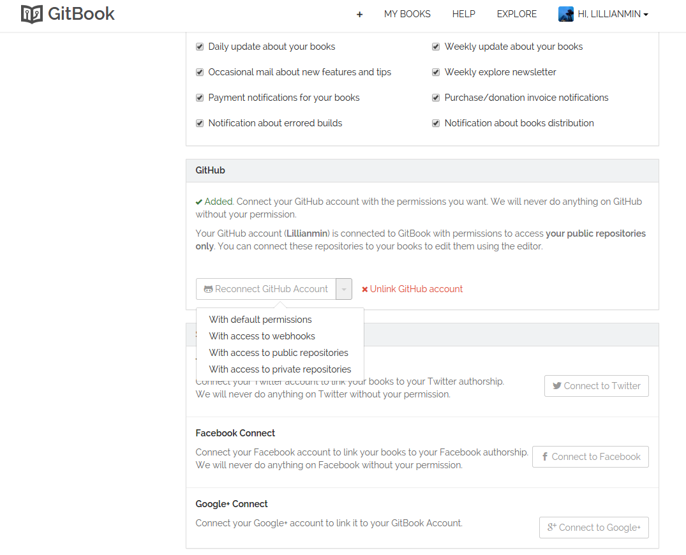
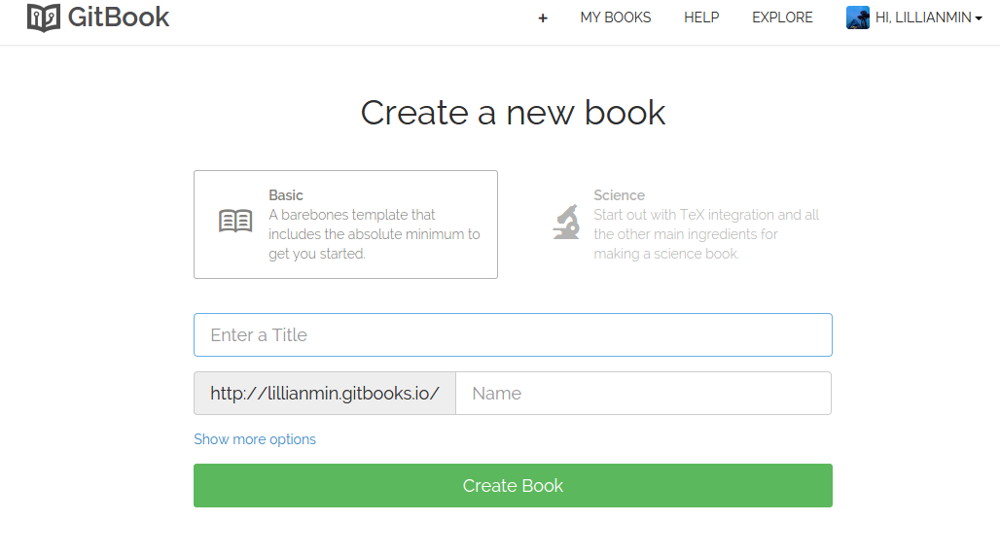
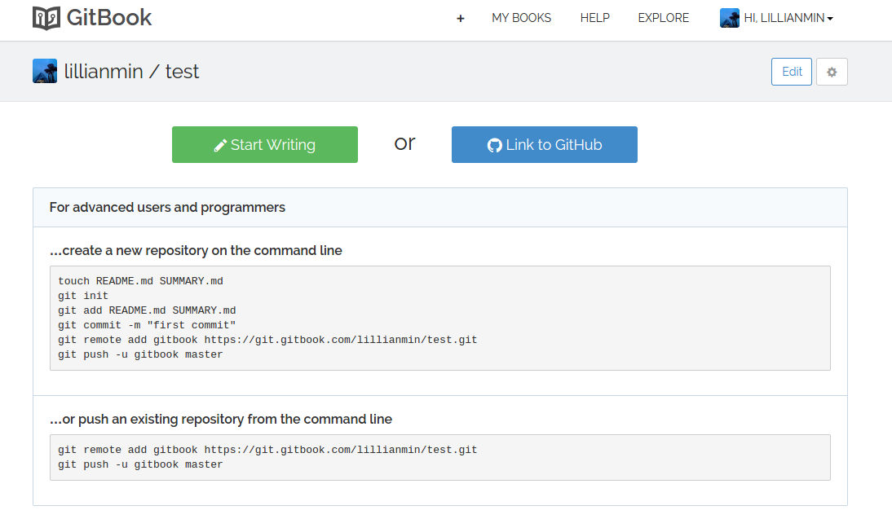
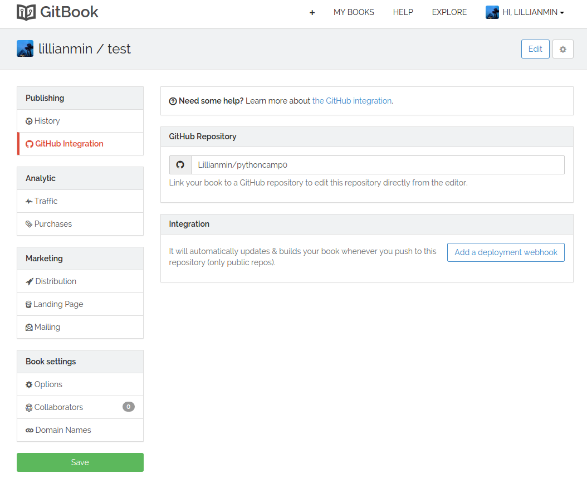
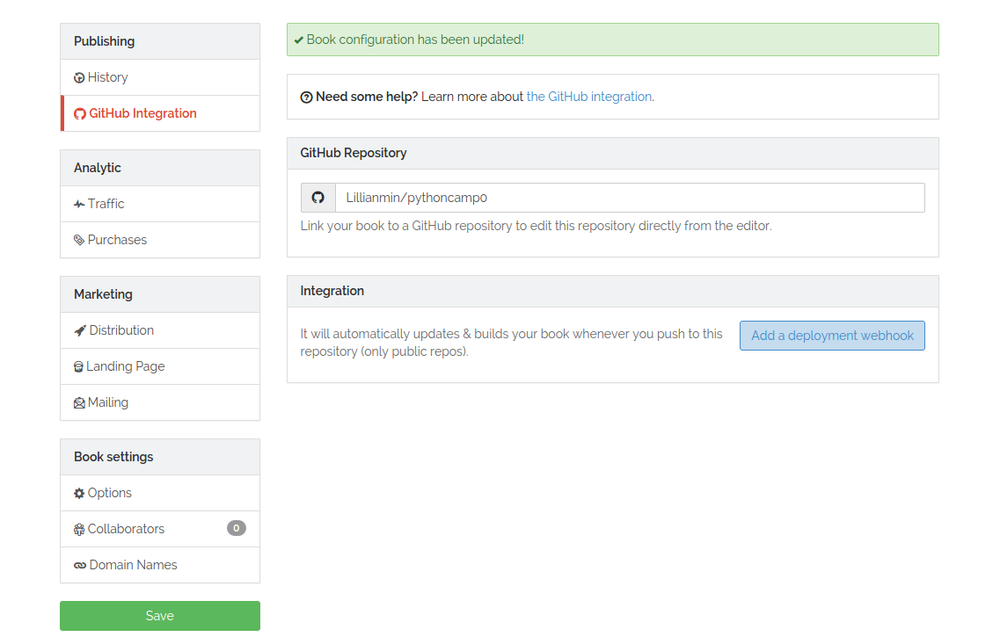
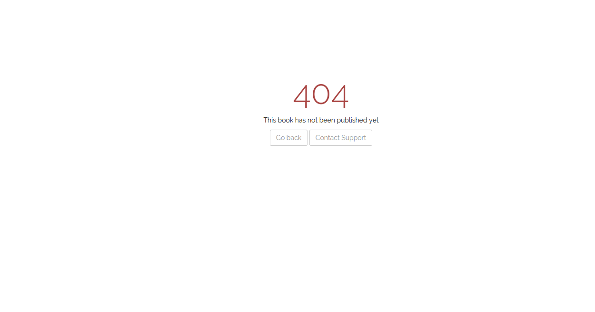
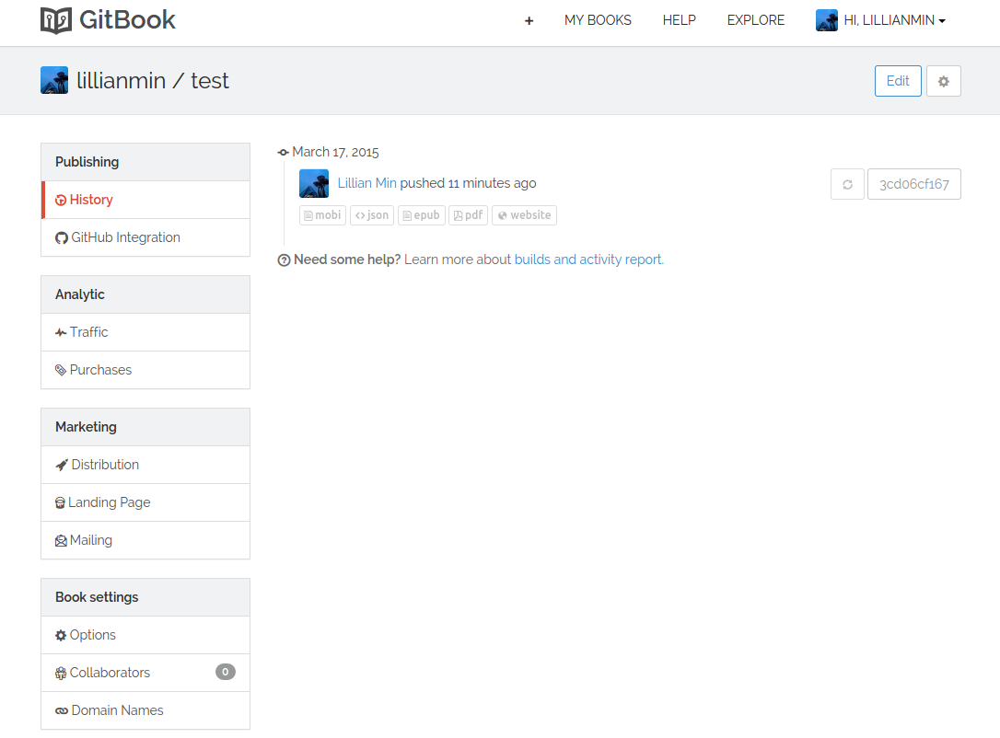
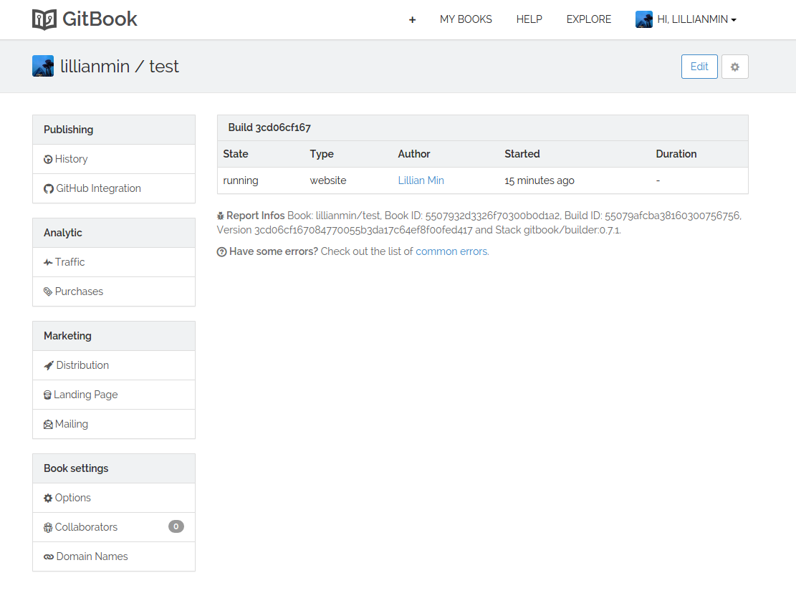

#GitBook Link Github

1. 使用Github用户登陆Gitbook

2. ”Account Setting“->"Profile"->"Github",设置权限Access To Webhook 或者Acces To public Repositories”。此处一定要设置，否则link to Github会有问题。参考[GitHub Integration](http://help.gitbook.com/github/index.html)

2. 登陆后，点击“Create new book”,输入Title,"Create book".

4. 点击“Link to Github"

5. 输入“GitHub Repository“,点击左下角”Save“

6. 点击“add a deployment webhook”,提示“ Book configuration has been updated!”，则link成功。

7. 此时，查看book还是会提示404,是因为gitbook服务器在对刚刚link的repository进行编译。进入book的Settings，查看history，会有一条记录，而且记录下方的epub/website/mobi等均为黑色，点击右侧码进去，则可以看到提示，正在running.证明lin是成功了的。

8. 过半小时再查看，就可以看到内容。
