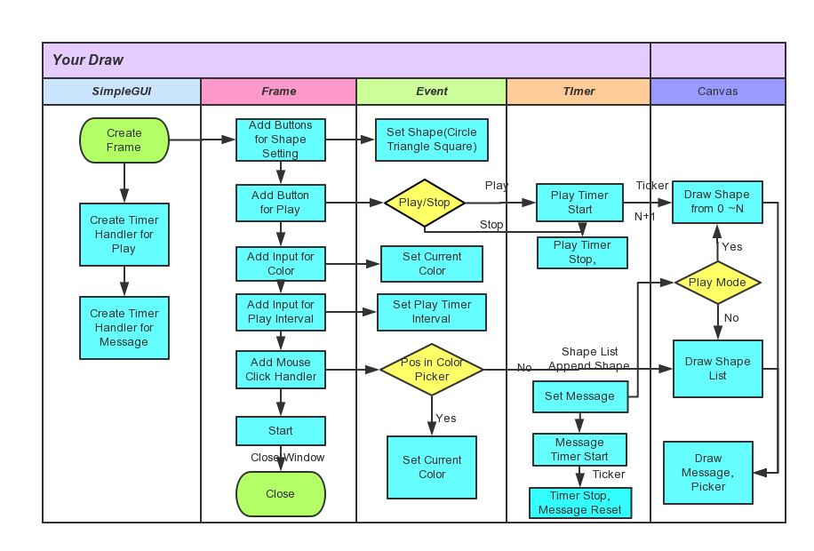

# Your Draw
[code on pythoncamp0](https://github.com/Lillianmin/omooc.py/blob/master/src/iippy-2/your_draw.py)
# V1
[codeskulptor](http://www.codeskulptor.org/#user39_WzrwqDz913YgHET.py)

* draw
* color set
* timer
* play

Bug:
* set interval not work when playing

# V2
[codeskulptro](http://www.codeskulptor.org/#user39_qVvqibXQ0S8nydd.py)

* color picker

# V3
[code on pythoncamp0](https://github.com/Lillianmin/omooc.py/blob/master/src/iippy-2/your_draw.py)

* file save
* 本地需要安装simpleguics2game(依赖pygame,matplotlib）

# 学习过程
* 视频学习。2h，公交上完成。重点截屏。
* simplegui本地环境(环境搭建时，写的笔记)。1h(Ubuntu)+2.5h(Windows,坑）。
* 基本功能coding。8h。
* 附加功能。3h(文件知识点学习+测试程序)+2h(整合进Draw)
* 教程。0.5h(python基础)+1h(基本功能的流程图)+2h(本文)

# 构思
## 基本功能
* 实现基本的点彩绘图、选择形状
* 添加颜色设置,绘图时，之前的图案不丢失
* 添加timer,添加回放，完成V1
* 添加Color Picker，完成V2

## 附加功能
* 添加文件的保存，与打开文件回放。完成V3。

# 开发流程
以本地代码仓库为主，当要提交V1/V2作业时，再将代码在codeskulptor中打开，调试后提交。V3完全在本地开发。
在codeskulptor中调试时发现与本地冲突如下：

* 本地Tab，占8个空格。codeskulptor占四个。对策：严格按照四个空格来缩进。
* global 在函数中声明时，本地可以在子快中，比如else后，而codeskulptor不行。对策：不在函数子块中声明global。

## 基本功能
* 

### 实现基本的点彩绘图、选择形状
  * frame 添加Circle, Square, Triangle形状选择按钮,完成形状设置
  ```
def shape_circle():
def shape_triangle():
def shape_square():
frame.add_button("Circle", shape_circle)
frame.add_button("Triangle", shape_triangle)
frame.add_button("Square", shape_square)
  ```

  * 通过鼠标位置，计算正方形、三角形的所有点坐标
  ```
def get_square_points(x, y, length):
def get_triangle_points(x, y, length):
  ```
  * frame添加鼠标点击事件处理，在画布上画出当前形状
  ```
def draw(canvas):
        canvas.draw_circle(pos, 30, 2, "Black", "Red")
        canvas.draw_polygon(get_triangle_points(pos, 60), 2, "Black", "Red")
        canvas.draw_polygon(get_square_points(pos, 60), 2, "Black", "Red")
def mouse_click(pos):
frame.set_mouseclick_handler(mouse_click)
  ```

### 添加颜色设置,绘图时，之前的图案不丢失
* 颜色设置，颜色名称与颜色RGB输入合法性检测
* 使用dictionary存放单个点的信息
```
{"x":x, "y":y, "shape":shape, "color":color}
```
* 使用list存放所有点的信息，当鼠标点击时，在mouse_click处理函数中，向list.append(dictionary)
```
shape={"x":pos[0], "y":pos[1], "shape":cur_shape, "color":cur_color}
 shape_list.append(shape)
```
### 添加timer,添加回放，完成V1
### 添加Color Picker，完成V2

## 附加功能
### 添加文件的保存，与打开文件回放。完成V3。
* 先写一个测试程序，完成对文件的保存、关闭、写、读操作的学习
* 添加回放保存、与回放文件播放至最终代码中。这里比测试程序多的一个知识点是str转list


